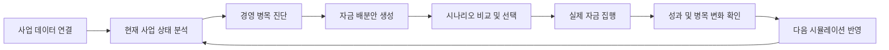

# SCB 대출 기회를 성장으로 잇는 자금 배분 시뮬레이터

> 사업 데이터를 바탕으로 현재의 경영 병목을 진단하고, 대출금 사용 시나리오를 비교한 뒤, 실제 집행 결과를 다음 의사결정에 반영하는 소상공인 자금 활용 지원 서비스입니다.

소상공인에게 대출은 자금 확보의 끝이 아니라 중요한 경영 의사결정의 시작입니다.

이 프로젝트는 단순히 대출 가능 여부를 안내하는 데서 그치지 않습니다. 사업자가 확보한 자금을 어디에, 얼마나 사용해야 할지 여러 시나리오로 비교하고, 실제 집행 이후의 변화까지 추적해 다음 판단으로 연결합니다.

## 과제 배경

소상공인은 대출을 통해 사업에 필요한 자금을 확보하더라도 다음과 같은 질문에 스스로 답해야 합니다.

- 지금 사업에서 가장 먼저 해결해야 할 문제는 무엇인가.
- 마케팅, 설비, 인력, 재고 중 어디에 우선 투자해야 하는가.
- 현재 매출과 비용 구조에서 대출 상환을 감당할 수 있는가.
- 자금을 집행한 뒤 실제로 사업이 개선됐는가.

같은 업종이라도 상권, 매출 패턴, 비용 구조와 고객 특성이 다르기 때문에 일반적인 성공 사례를 그대로 적용하기 어렵습니다.

그러나 기존의 금융 지원 과정에서는 대출 실행 이후의 자금 활용과 성과 확인이 사업자 개인의 경험과 판단에 맡겨지는 경우가 많습니다.

## 문제 정의

### 1. 사업의 진짜 병목을 알기 어렵습니다.

매출이 부족하다는 결과는 확인할 수 있지만, 원가율, 인건비, 시간대별 매출, 재구매율, 좌석 활용도, 온라인 판매 비중 중 무엇이 성장을 막고 있는지는 쉽게 판단하기 어렵습니다.

단순한 매출 증감만으로는 어떤 문제를 먼저 해결해야 하는지 알 수 없습니다.

### 2. 대출금 사용안을 객관적으로 비교하기 어렵습니다.

같은 대출금이라도 마케팅에 집중하는 경우, 설비와 운영 개선에 분산하는 경우, 여러 영역에 균등하게 투자하는 경우의 의미가 다릅니다.

사업자는 각 선택이 어떤 병목에 대응하는지, 상환 부담을 감당할 수 있는지, 집행 후 어떤 지표를 확인해야 하는지 비교할 기준이 필요합니다.

### 3. 실제 집행 경험이 다음 의사결정에 축적되지 않습니다.

자금을 어디에 사용했고 어떤 문제가 개선됐는지 체계적으로 기록되지 않으면 다음 대출이나 투자에서도 비슷한 판단을 처음부터 반복하게 됩니다.

한 번의 추천보다 중요한 것은 실제 결과를 확인하고 다음 판단을 더 나은 방향으로 조정하는 과정입니다.

## 솔루션

이 프로젝트는 사업 진단부터 결과 검증까지 이어지는 자금 활용 선순환 구조를 제공합니다.



### 진단합니다.

사업자의 매출, 비용, 운영 데이터와 상권 데이터를 함께 분석합니다.

유사한 사업 환경과 비교해 현재 확인이 필요한 병목 후보를 찾고, 어떤 데이터와 기준으로 판단했는지 함께 제공합니다.

### 비교합니다.

동일한 대출금을 서로 다른 목적에 배분한 세 가지 시나리오를 제시합니다.

- 병목 집중형은 가장 심각한 문제에 자금을 집중합니다.
- 진단 비례 대응형은 발견된 문제의 심각도에 따라 자금을 나눕니다.
- 균등 분산형은 여러 영역에 동일하게 배분하는 비교 기준선입니다.

각 시나리오는 자금 배분 비율뿐만 아니라 월 상환 부담, 예상 현금흐름, 집행 후 확인할 목표 지표와 주의사항을 함께 보여줍니다.

### 검증하고 다시 반영합니다.

사업자는 시뮬레이션 이후 실제 자금 사용 내역과 최신 사업 데이터를 등록할 수 있습니다.

서비스는 개선된 병목, 여전히 남아 있는 병목, 새롭게 확인된 병목을 구분합니다. 완료된 결과는 다음 시뮬레이션에서 지속 병목의 우선순위와 과거 집행 이후 발생한 부작용 경고에 반영됩니다.

## 핵심 사용자 여정

1. 사업 기본정보와 매출·비용 데이터를 연결합니다.
2. 현재 사업 상태와 개선이 필요한 병목 후보를 확인합니다.
3. 대출금액, 금리, 상환 방식과 상환 기간을 입력합니다.
4. 서로 다른 세 가지 자금 배분안을 비교합니다.
5. 자신의 상황에 맞는 시나리오를 선택해 저장합니다.
6. 실제 집행 이후 자금 사용 내역과 최신 사업 데이터를 입력합니다.
7. 예상과 실제 결과, 병목 변화를 확인합니다.
8. 축적된 결과를 반영해 다음 시뮬레이션을 시작합니다.

## UI

### 1. 서비스 소개


서비스가 해결하려는 문제와 전체 이용 흐름을 한눈에 확인할 수 있습니다. 샘플 데이터를 이용하면 실제 사업장 데이터를 등록하지 않고도 전체 시뮬레이션을 체험할 수 있습니다.

### 2. 사업 데이터 연결 및 병목 진단


사업자의 매출·비용 데이터와 지역 기반 상권 데이터를 종합해 현재 사업 상태를 보여줍니다.

각 병목은 단순한 경고로 끝나지 않고 현재 수치, 비교 기준, 근거 출처와 판단 방법을 함께 제공합니다.

### 3. 자금 배분 시나리오 비교


동일한 대출금을 서로 다른 목적으로 배분한 세 가지 시나리오를 동일한 기준에서 비교합니다.

사업자는 배분 비율, 월 상환 부담, 잔여 현금, 대응하는 병목과 집행 후 확인할 지표를 함께 살펴볼 수 있습니다.

### 4. 실제 집행 및 결과 검증


시뮬레이션에서 선택한 안과 실제 자금 사용 내역이 달라도 실제 집행안을 기준으로 결과를 다시 계산합니다.

집행 전후의 사업 지표를 비교해 개선된 병목과 새롭게 나타난 병목을 확인할 수 있습니다.

### 5. 선순환 대시보드


시뮬레이션과 결과 검증 이력을 회차별로 확인합니다.

최근까지 해결되지 않은 병목과 이전 집행 결과를 바탕으로 다음 시뮬레이션에서 우선 확인해야 할 항목을 안내합니다.

## 사용자 예시

연희동에서 카페를 운영하는 사업자가 매출·비용 데이터를 등록합니다.

서비스는 온라인 판매 비중과 원가율을 주요 병목 후보로 진단하고, 동일한 대출금을 다르게 배분한 세 가지 안을 제시합니다.

- A안은 온라인 채널과 마케팅에 집중합니다.
- B안은 설비, 운영 개선과 마케팅에 자금을 나눕니다.
- C안은 여러 영역에 동일하게 배분합니다.

사업자는 각 안의 상환 부담과 자금 여력을 비교해 자신의 상황에 맞는 안을 선택합니다.

집행 이후 실제 사용 내역과 최신 데이터를 입력하면 온라인 판매 비중이 개선됐는지, 원가율 문제가 남아 있는지, 새로운 문제가 발생하지 않았는지 확인할 수 있습니다. 이 결과는 다음 시뮬레이션의 판단 근거로 이어집니다.

## 차별점

### 대출 실행 이후까지 연결합니다.

대출 가능 여부나 상품 추천에서 끝나지 않고 자금 사용 계획, 실제 집행, 결과 검증을 하나의 흐름으로 연결합니다.

### 사업자마다 다른 문제에서 출발합니다.

모든 사업자에게 동일한 성공 공식을 제시하지 않습니다. 사업 데이터와 비교 기준을 바탕으로 현재 사업에서 우선 확인해야 할 문제를 찾습니다.

### 하나의 답을 강요하지 않습니다.

AI가 정답 하나를 결정하는 대신 서로 다른 목적을 가진 세 가지 배분안을 제공합니다. 사업자는 각 안의 근거와 위험을 비교하고 최종 결정을 내립니다.

### 실제 결과를 다음 판단에 반영합니다.

지속된 병목과 과거 집행 이후 새롭게 발생한 문제를 다음 시뮬레이션에 반영합니다. 사용할수록 사업자의 실제 경험이 의사결정 근거로 축적됩니다.

### 계산과 설명의 역할을 구분합니다.

병목 판정, 자금 배분, 상환 부담과 현금흐름은 정해진 데이터와 계산 규칙을 통해 산출합니다.

생성형 AI는 계산 결과를 임의로 바꾸지 않고, 산출된 결과와 판단 근거를 사업자가 이해하기 쉬운 문장으로 설명하는 역할을 담당합니다.

## 기대 효과

### 소상공인.

- 자기 사업 데이터에 근거해 자금 사용 우선순위를 판단할 수 있습니다.
- 여러 배분안과 상환 부담을 사전에 비교해 과도한 투자 위험을 줄일 수 있습니다.
- 집행 이후의 변화를 확인해 다음 투자와 대출 의사결정에 활용할 수 있습니다.
- 분석 결과뿐만 아니라 근거를 함께 확인해 최종 판단의 주도권을 유지할 수 있습니다.

### KB.

- 고객과의 관계를 대출 실행에서 대출 이후의 경영 지원까지 확장할 수 있습니다.
- 소상공인의 자금 사용 목적과 사업 변화를 지속적으로 이해할 수 있습니다.
- 고객의 사업 지속 가능성과 금융 건전성을 함께 지원하는 관계형 금융 기반을 마련할 수 있습니다.
- 축적된 집행과 성과 데이터를 향후 소상공인 금융상품 및 지원 정책 설계에 활용할 수 있습니다.

### 금융 생태계.

- 신용평가 중심의 금융 지원을 자금 활용과 성과 관리까지 확장하는 모델을 제시할 수 있습니다.
- 금융 데이터와 사업 데이터를 연결해 소상공인의 지속 가능한 성장을 지원할 수 있습니다.
- 자금 지원의 효과를 지속적으로 확인할 수 있는 데이터 기반을 마련할 수 있습니다.

## 판단 원칙과 한계

이 서비스는 특정 항목에 투자하면 매출이 일정 비율 증가한다고 단정하지 않습니다.

제공되는 결과는 현재 입력된 사업 데이터와 비교 기준을 바탕으로 계산한 의사결정 참고자료입니다. 실제 성과는 계절성, 상권 변화, 경쟁점 변화와 사업자의 실행 방식 등 다양한 외부 요인의 영향을 받을 수 있습니다.

병목은 확정된 경영 진단이 아닌 확인이 필요한 후보로 제공됩니다. 최종 자금 사용과 금융 의사결정의 책임은 사용자에게 있으며, 서비스는 사용자가 판단할 수 있도록 데이터와 근거를 투명하게 제공하는 것을 목표로 합니다.

## 주요 기능

| 구분 | 주요 기능 |
|---|---|
| 사업 데이터 연결 | 사업 기본정보와 매출·비용 파일 등록 |
| 상권 데이터 연계 | 사업 지역을 기준으로 공공 상권 데이터 조회 |
| 사업 상태 분석 | 재무·운영·상권 지표 종합 확인 |
| 병목 진단 | 비교 기준에 따른 병목 후보와 근거 제공 |
| 대출 조건 계산 | 금리, 기간, 거치 기간과 상환 방식 반영 |
| 자금 배분 | 목적이 다른 세 가지 배분안 생성 |
| 시나리오 비교 | 상환 부담, 현금흐름, 목표 지표 비교 |
| 실제 집행 등록 | 시뮬레이션 이후의 실제 사용 내역 기록 |
| 결과 검증 | 예상과 실제 지표 및 병목 변화 비교 |
| 선순환 대시보드 | 회차별 결과와 다음 시뮬레이션 준비 항목 확인 |

## 기술 구성

기술은 서비스의 사용자 흐름을 구현하고 판단 근거를 일관되게 관리하기 위해 다음과 같이 구성했습니다.

| 영역 | 구성 |
|---|---|
| Frontend | React, TypeScript, Vite |
| Backend | FastAPI, SQLAlchemy, PostgreSQL |
| AI·분석 | Python 기반 병목 진단, 자금 배분 및 재무 계산 |
| 데이터 | 사업자 업로드 데이터, 서울시 상권분석서비스 등 공공데이터 |
| 설명 생성 | 구조화된 분석 결과를 기반으로 한 LLM 설명 |

상세한 개발 환경과 API 사용 방법은 아래 문서에서 확인할 수 있습니다.

- [Backend 실행 및 API 안내](./backend/README.md)
- [AI 모듈 실행 안내](./ai/README)
- [AI 시뮬레이터 상세 설명](./ai/AI_시뮬레이터_최종정리.md)

## 프로젝트 구조

```text
.
├── frontend/    # 사용자 화면과 시뮬레이션·검증 UI
├── backend/     # 사업 데이터, 진단, 시뮬레이션과 검증 API
├── ai/          # 병목 진단, 자금 배분, 재무 계산과 결과 추적
└── docs/        # 설계 및 프로젝트 문서
```
